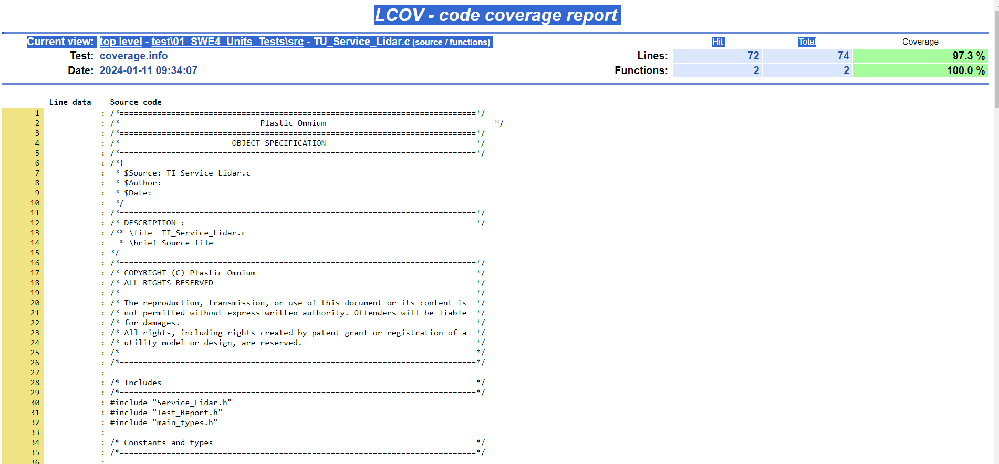

# Project Code Generator

## Description

This tool, aims to provide an automatic project code skeleton generator. 
It is based on Software Engineering Process group of Plastic Omnium

## Table of Contents  

README is divided in paragraph :

- [Installation](INSTALL.md) 
 
## Software Engineering Process group


The Software Architecture contains in Software Architectural Design (SWAD) is composed of :
   - Software Elements : Result of the decomposition of the architecture on software level: The software is decomposed into elements of the software architecture across appropriate hierarchical levels down to the software components (the lowest level elements of the software architecture).
   - Software Components : Software-Components (SW-C) are architectural elements that provide and/or require interfaces and are connected to each other through the Virtual Functional Bus to fulfill architectural responsibilities. The Software Component is the central structural element used when building a system at the VFB-level. A SW-C has well-defined ports, through which the component can interact with other Software Components.
A Software Component has a formal description defined by the Software Component template. Software Components can be abbreviated as SW-Cs.
A SW-C contains a Software Component Description (SW-CD) and the implementation.
In Automotive SPICE V3.0 the term "software component" is used for the lowest level elements of the software architecture for which finally the detailed design is defined. A software "component" consists of one or more software "units".

The Software Detailed Design Component is a specific detailed design for a component and is composed of :
    - Units : Part of a software component which is not further subdivided. 


## Project Architecture


He will needs in input an "Architecture.c" file with all your compents and units inside in this format (use it as an example) :
Please be aware : spaces at end of lines are forbidden

```bash
#Product
#$NAME | $PROJECT_ID | $OEM
INVERTER | 1272489 | IVECO

#Component_HighLevel
#$NAME
upg_app

#Units
#$UNIT | $FUNCTION  | $PARAMETER  | $ROLE 
Application | Init_Hook  | void
Application | Background_Hookgure | void
#FinComponent

#Component_Middleware
#$NAME
Aux

#Units
#$UNIT | $FUNCTION  | $PARAMETER | $ROLE 
TS32|s32DAux_eInit_Exe|void
TS32|s32DAux_eReloadInternal_Exe|TU32 Fu32MagicNumber 
#FinComponent

#Component_Driver
#$NAME
Drv_Can

#Units
#$UNIT | $FUNCTION  | $PARAMETER | $ROLE 
DCan | eInit_Exe| TU16 Fu16CtrlId
DCan | eConfigBaudRate_Exe|TU16 Fu16CtrlId,TU16 Fu16Baudrate 
#FinComponent
```

Each component is sub-divided in sections


Coverage Folder will have all coverage results for 

